# Lab3-Analizator_wynikow - Dokumentacja

## Opis zadania
Celem tego zadania jest opracowanie modeli , które przewidują wartość zmiennej `score` na podstawie wielu zmiennych, w tym demograficznych, ekonomicznych i edukacyjnych. Wykorzystano kilka modeli, takich jak Gradient Boosting, Random Forest, XGBoost i wielowarstwowy perceptron (MLP), które oceniono za pomocą grid search i kroswalidacji.


## Struktura plików
- `s24154.py`: Główny skrypt do uruchomienia procesu uczenia maszynowego i oceny modeli.
- `charts/`: Katalog zawierający wygenerowane histogramy i wykresy słupkowe.
- `model_training.log`: Plik z zapisanymi krokami i informacjami o procesie trenowania.
- `requirements.txt`: Plik wymagań do zainstalowania

## Przygotowanie i uruchomienie
### Wymagania wstępne
- Python >= 3.11
- pip 

### Klonowanie repozytorium
```bash
git clone https://github.com/chrzanof/ASI-Lab3.git
cd ASI-Lab3
```

### Instalacja pakietów
```bash
pip install -r requirements.txt
```

### Pobranie danych
```bash
curl -o CollegeDistance.csv https://vincentarelbundock.github.io/Rdatasets/csv/AER/CollegeDistance.csv
```

### Uruchomienie skryptu uczącego modele
```bash
python3 s24154.py CollegeDistance.csv models --n_folds 5 --seed 42
```

### Uruchomienie API lokalnie
```bash
python3 app.py
```

### (Alterantywnie) Pobranie obrazu z Docker Huba
```bash
sudo docker pull chrzanof/my-app
```

### (Alterantywnie) Uruchomienie kontenera z obrazu
```bash
sudo docker run -p 5000:5000 chrzanof/my-app
```

## Korzystanie z API
API obsługuje dane wejściowe w formacie JSON, przyjmując listę cech wejściowych (bez zmiennej `score`).

### Przykład zapytania `curl`(JSON)
```bash
curl -X POST http://127.0.0.1:5000/predict \
-H "Content-Type: application/json" \
-d '{
    "input": [
        {
            "gender": "male",
            "ethnicity": "other",
            "fcollege": "yes",
            "mcollege": "no",
            "home": "yes",
            "urban": "yes",
            "unemp": 6.2,
            "wage": 8.09,
            "distance": 0.2,
            "tuition": 0.889,
            "education": 12,
            "income": "high",
            "region": "other"
        }
    ]
}'
```
### Przykład odpowiedzi
```json
{
  "prediction": [
    49.128299713134766
  ]
}
```

## Analiza i inżynieria danych
### Analiza
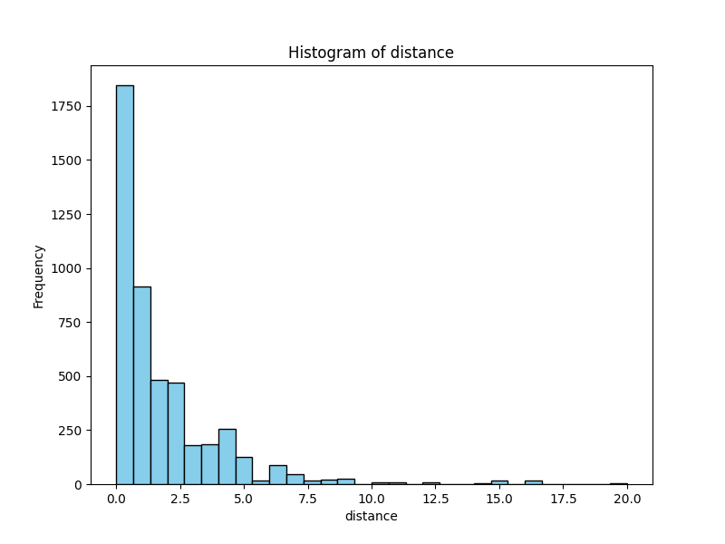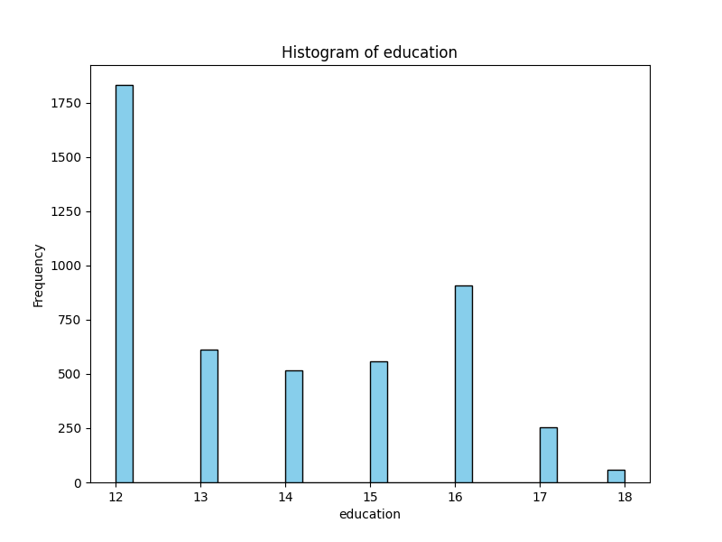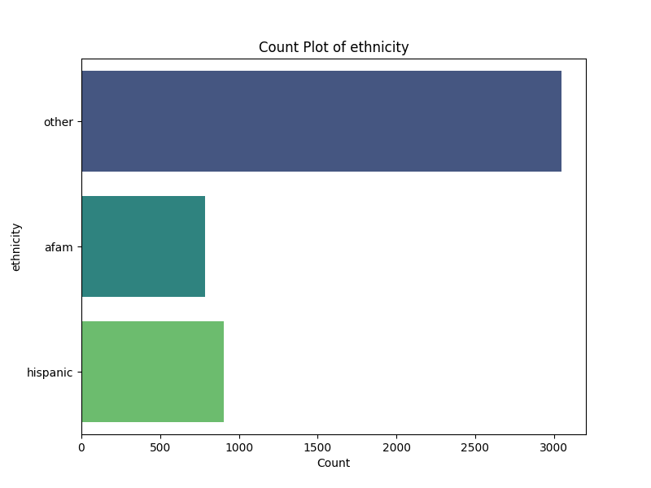
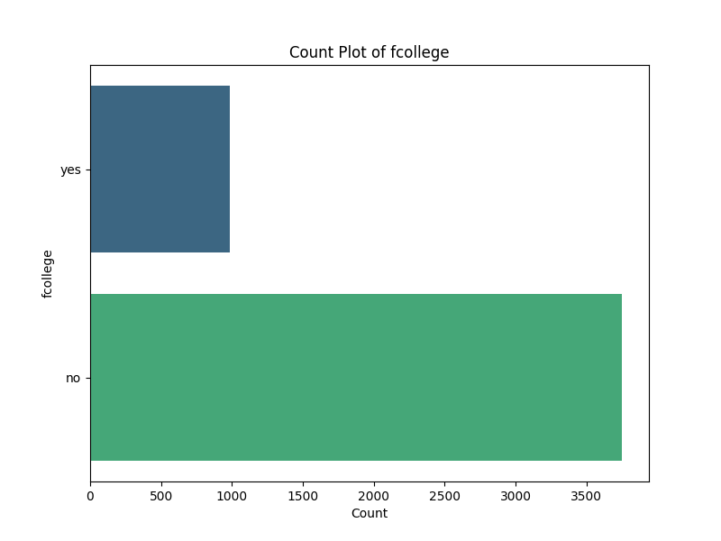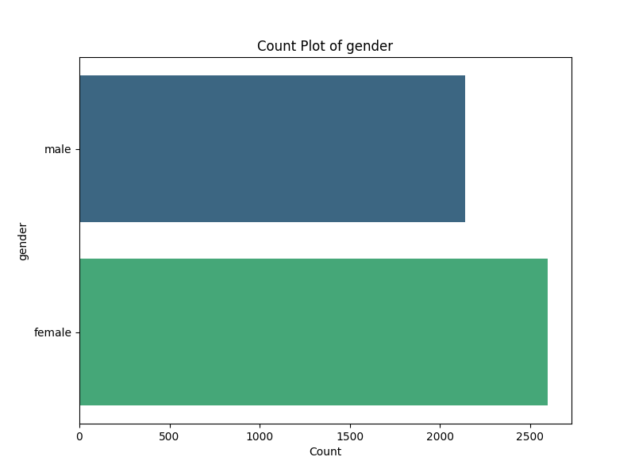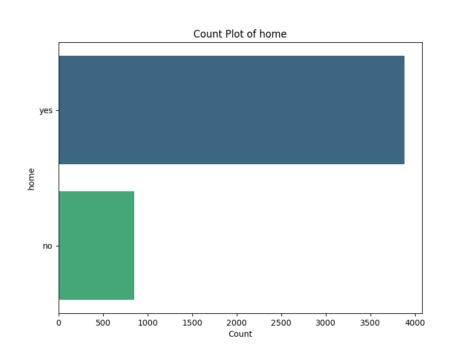
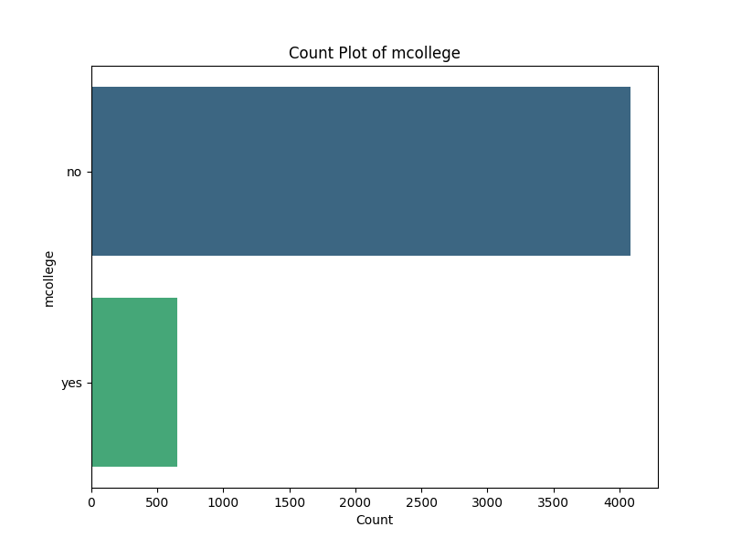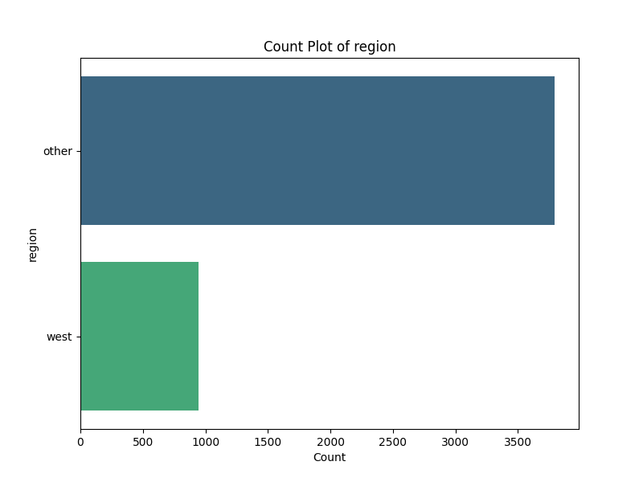
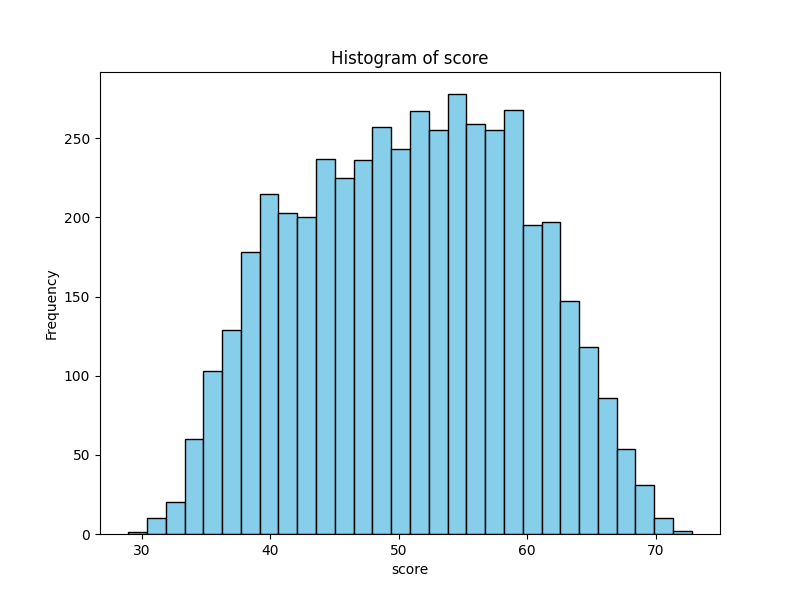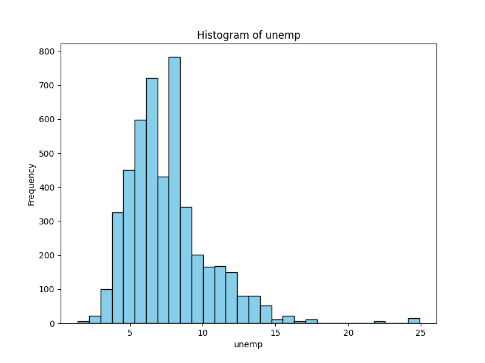
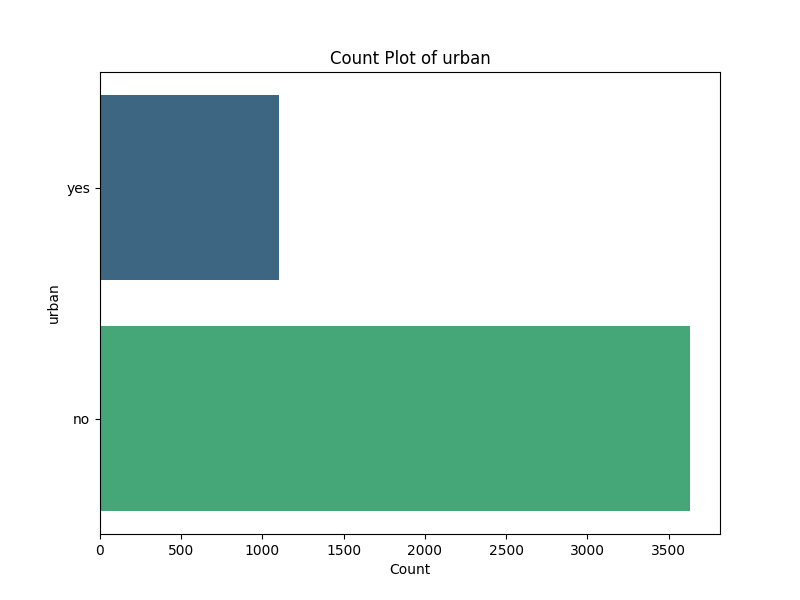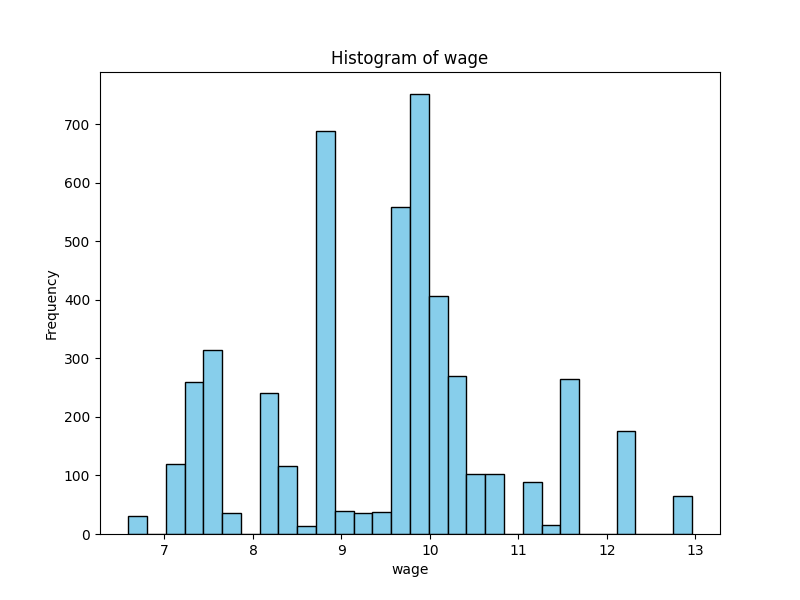

### Inżynieria
- została usunięta kolumna `rownames` ponieważ były to tylko ponumerowane kolumny

## Wyniki i podsumowanie
Modele zostały ocenione przy użyciu kroswalidacji oraz podzielone na zbiory: treningowy, walidacyjny i testowy. Wyniki dla każdego modelu przedstawiają metryki: MAE, MSE i R^2.

### Wyniki
Dla każdego modelu uzyskano poniższe wyniki:

| Model              | Zbiór         | MAE        | MSE        | R^2      |
|--------------------|---------------|------------|------------|----------|
| GradientBoosting    | Test          | 5.665896   | 49.336871  | 0.317022 |
| GradientBoosting    | Train (CV)    | 5.734156   | 49.964912  | 0.336743 |
| GradientBoosting    | Validation     | 6.045087   | 53.805321  | 0.331545 |
| MLPRegressor       | Test          | 6.027713   | 56.466550  | 0.218325 |
| MLPRegressor       | Train (CV)    | 6.012229   | 55.520003  | 0.263003 |
| MLPRegressor       | Validation     | 6.255663   | 58.880428  | 0.268494 |
| RandomForest       | Test          | 5.710428   | 51.248257  | 0.290563 |
| RandomForest       | Train (CV)    | 5.844986   | 52.089164  | 0.308545 |
| RandomForest       | Validation     | 6.011434   | 54.111517  | 0.327741 |
| XGBoost            | Test          | 5.657715   | 49.245949  | 0.318281 |
| XGBoost            | Train (CV)    | 5.724472   | 49.678166  | 0.340550 |
| XGBoost            | Validation     | 6.042898   | 53.889854  | 0.330495 |

### Wnioski

1. **MAE**: Najlepszy wynik osiągnął model **XGBoost** na zbiorze testowym, uzyskując wartość **5.657715**. To wskazuje na dobrą dokładność modelu w przewidywaniu wartości.

2. **MSE**: Model **XGBoost** również wykazał najlepszy wynik w tej metryce na zbiorze testowym z wartością **49.245949**, co sugeruje, że model jest skuteczny w minimalizowaniu błędów kwadratowych.

3. **R^2**: Najwyższy współczynnik determinacji uzyskał model **XGBoost** na zbiorze treningowym z krzyżową walidacją (Train (CV)), osiągając wartość **0.340550**. To sugeruje, że model lepiej dopasowuje się do danych treningowych w porównaniu do innych modeli.


